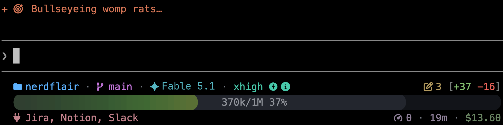
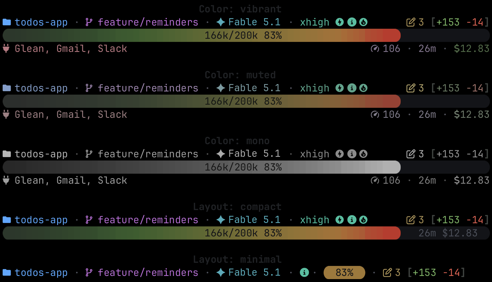
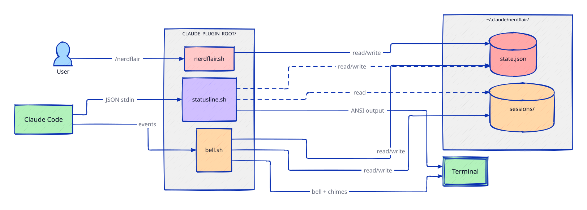

<p align="center">
  
</p>

<p align="center">
  <a href="LICENSE"></a>
  
  
  
</p>

<p align="center">
  <strong>A configurable bash statusline and audio/spinner pack for Claude Code</strong>
</p>



<details>
<summary><strong>Layout and color variations</strong></summary>



</details>


## Quick Start

```
/plugin marketplace add jcraigk/nerdflair
/plugin install nerdflair@jcraigk/nerdflair
/nerdflair install
```

Restart Claude Code after install for the changes to take effect.


## Features

- **3 layout modes:** full (3 rows), compact (2 rows), minimal (1 row)
- **Context bar:** color shifts from green to red as context fills, with a compaction threshold marker
- **3 color palettes**: vibrant (full color), muted (desaturated), mono (grayscale)
- **Custom spinner verbs:** 150 themed thinking/working phrases
- **Terminal bell**: (tab indicator) on Notification, PermissionRequest, and Stop events
- **Audio chimes (macOS, Linux)**: 20 styles, configurable per-event, adjustable volume
- **Project folder display:** always shows the launch directory, not the current subdirectory Claude may have navigated to
- Git branch, files edited, and lines added/removed
- Model name with indicators for output style, reasoning effort, extended thinking, and fast mode
- Active MCP servers
- Session cost, API duration, and token throughput
- Chime style label (shown for the random style before any cost is incurred)


## Prerequisites

**`jq` is required.** The statusline parses Claude Code's session JSON with [jq](https://jqlang.github.io/jq/); without it the statusline exits and renders nothing.

```bash
brew install jq        # macOS
sudo apt install jq    # Debian/Ubuntu
```

**A Nerd Font is required.** The statusline uses [Nerd Font](https://www.nerdfonts.com/) glyphs for icons and Powerline caps. Without one installed, characters render as boxes.

Install via Homebrew or download from [nerdfonts.com](https://www.nerdfonts.com/):

```bash
brew install --cask font-jetbrains-mono-nerd-font
```

<details>
<summary><strong>Terminal font configuration</strong></summary>

Installing only puts the font files on disk; your terminal won't use it until you select it:

| Terminal | Where to set the font |
|----------|----------------------|
| **iTerm2** | Settings -> Profiles -> Text -> Font -> select "JetBrainsMono Nerd Font" |
| **Terminal.app** | Settings -> Profiles -> (your profile) -> Font -> Change -> select "JetBrainsMono Nerd Font" |
| **Warp** | Settings -> Appearance -> Terminal font -> select "JetBrainsMono Nerd Font" |
| **Ghostty** | Add `font-family = JetBrainsMono Nerd Font` to `~/.config/ghostty/config` |
| **VS Code terminal** | Settings -> search "terminal font" -> set Terminal > Integrated: Font Family to `JetBrainsMono Nerd Font` |

</details>


## Usage

Use the `/nerdflair` command to configure the statusline:

<details>
<summary><strong>Command reference</strong></summary>

| Command | Effect |
|---------|--------|
| `/nerdflair` | Show current settings and command reference |
| `/nerdflair install` | Install or upgrade (font check, settings.json config; preserves existing settings) |
| `/nerdflair uninstall` | Remove nerdflair from settings and clean up data |
| `/nerdflair info` | Show current settings without changing anything |
| `/nerdflair chime-events` | Show/toggle which events play chimes |
| `/nerdflair chime-session [style]` | Set chime style for this session only (plays preview) |
| `/nerdflair chime-style [style]` | Set or cycle global chime style (random, BalladPiano, ...) |
| `/nerdflair chime-volume [0-100]` | Set chime volume (0 = muted) |
| `/nerdflair color-palette [mode]` | Set or cycle palette (vibrant, muted, mono) |
| `/nerdflair layout [mode]` | Set or cycle layout (full, compact, minimal) |
| `/nerdflair spinner-verbs [enable\|disable]` | Toggle custom spinner verbs on/off |
| `/nerdflair terminal-bell` | Toggle terminal bell on/off (tab indicator) |
| `/nerdflair width [auto\|50-150]` | Set layout width |

</details>


## Cursor / VS Code Extension

A lightweight extension brings NerdFlair's audio chimes to Cursor (or VS Code). It reuses the same 20 chime styles from the Claude Code plugin.

### What's included

- **Random style per session** — one of 20 chime styles is chosen at random each time the editor opens
- **Audio chimes via [Cursor hooks](https://docs.cursor.com/agent/hooks)** — SessionStart, Stop, and SessionEnd sounds
- **Status bar** — shows the current style; click to cycle through all 20

### Install

Clone the repo and symlink the extension into your editor's extensions directory:

```bash
git clone https://github.com/jcraigk/nerdflair.git ~/nerdflair

# Cursor
ln -s ~/nerdflair/cursor-extension ~/.cursor/extensions/nerdflair-chimes

# VS Code (if using VS Code instead)
ln -s ~/nerdflair/cursor-extension ~/.vscode/extensions/nerdflair-chimes
```

Then add the hooks config at `~/.cursor/hooks.json` (adjust the path if you cloned elsewhere):

```json
{
  "version": 1,
  "hooks": {
    "sessionStart": [
      {
        "command": "bash ~/nerdflair/cursor-extension/play-chime.sh SessionStart"
      }
    ],
    "stop": [
      {
        "command": "bash ~/nerdflair/cursor-extension/play-chime.sh Stop"
      }
    ],
    "sessionEnd": [
      {
        "command": "bash ~/nerdflair/cursor-extension/play-chime.sh SessionEnd"
      }
    ]
  }
}
```

Restart the editor. You should hear a startup chime and see the style name in the status bar.

### Settings

Search "nerdflair" in Settings to configure:

| Setting | Default | Description |
|---------|---------|-------------|
| `nerdflair-chimes.volume` | `1.0` | Playback volume (0–1) |
| `nerdflair-chimes.audioDirectory` | auto-detect | Override path to `assets/audio` |

> **Note:** The extension requires `jq` and `afplay` (macOS) or `paplay` (Linux) for audio playback.


## How It Works (Claude Code)

Three bash scripts and one JSON state file.



- **Renderer** (`scripts/statusline.sh`) — Claude Code pipes session JSON on every refresh. Reads state, outputs ANSI-colored statusline.
- **Configurator** (`scripts/nerdflair.sh`) — Handles `/nerdflair` commands. Reads and writes the state file.
- **Hook Handler** (`hooks/bell.sh`) — Fired on Claude Code events. Sends terminal bell and plays audio chimes (macOS, Linux) based on user-defined config.

All settings persist in `~/.claude/nerdflair/state.json`. Per-session data (chime style) is stored as JSON in `~/.claude/nerdflair/sessions/` and cleaned up automatically.


## Update

```
/plugin update nerdflair
/nerdflair install
```

`/plugin update` pulls the latest version. `/nerdflair install` refreshes the statusline config while preserving your existing settings. Restart Claude Code after updating.


## Uninstall

```
/nerdflair uninstall
/plugin uninstall nerdflair
```

`/nerdflair uninstall` removes nerdflair's statusline, spinner verbs, and data from `~/.claude/`. `/plugin uninstall` removes the plugin itself. Restart Claude Code after uninstalling.
